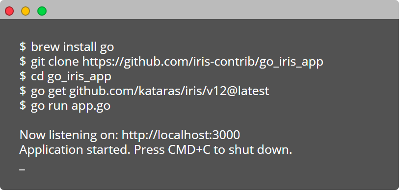

# A basic web app built in Iris web framework for Go



## Getting started

1. Install Go (Golang), version 1.13 and above
    * Using [Brew](https://brew.sh/)
    * Or by navigating to https://golang.org/dl.
2. Download & Install [Iris](https://iris-go.com) using go get: `go get github.com/kataras/iris/v12@latest`
3. Clone the repository
4. Run the web app: `go run app.go`.

```bash
$ brew install go
$ git clone https://github.com/gauravtiwari/go_iris_app
$ cd go_iris_app
$ go get github.com/kataras/iris/v12@latest
$ go run app.go
```
